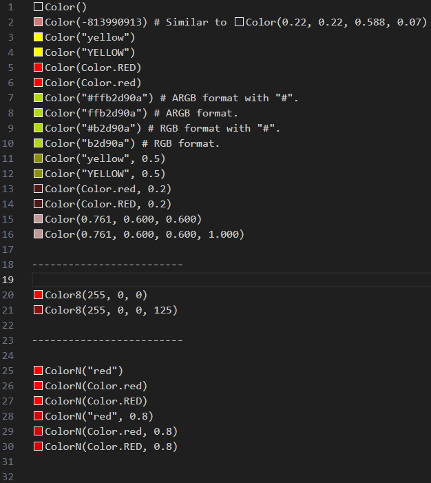

# gd-color-picker

## Features

Show color picker for GDScript(extname=`gd`) in vscode.

## Extension Settings

* `gdColorPicker.useCache`: Enable color cache to improve performance by about 5x, only recommended for big file. `false` as default. When meet bugs, disable this.

## License
MIT License

## Release Notes

### 0.0.1
Base and only one feature.
